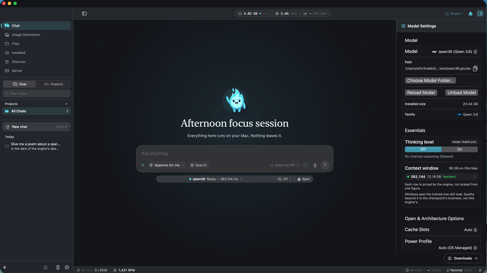
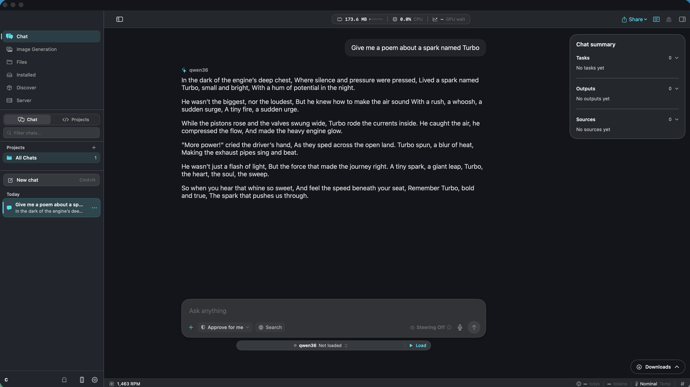

<p align="center">
  
</p>

<p align="center">
  <a href="https://github.com/whit3rabbit/turbospark/actions/workflows/ci.yml"></a>
  <a href="https://github.com/whit3rabbit/turbospark/actions/workflows/release.yml"></a>
  <a href="https://crates.io/crates/turbospark-cli"></a>
  <a href="https://github.com/whit3rabbit/turbospark/stargazers"></a>
  <a href="LICENSE"></a>
  <a href="docs/RELEASE.md"></a>
</p>

<p align="center">
  <a href="assets/welcome-screen.png"></a>
  <a href="assets/chat-interface.png"></a>
</p>

<p align="center">
  <a href="#install">Install</a> | <a href="#quickstart">Quickstart</a> | <a href="#supported-models">Supported Models</a> | <a href="#memory-and-benchmark-results">Benchmarks</a> | <a href="#supported-features">Features</a> | <a href="#more-details">More Details</a> | <a href="#license">License</a>
</p>

** This is a early work in progress. Expect bugs and breaking changes **

TurboSpark is a native macOS app and Rust workspace for running local language models on Apple Silicon. Its main advantage is fine-grained Mixture-of-Experts (MoE) streaming: routed expert weights stay on SSD until they are needed, so supported large MoE models can run with a small bounded memory footprint.

I built it as a hobby/side project as an alternative to LM Studio but there are other projects like Unsloth Desktop which are a lot more refined.

The app provides desktop chat and agent tools. The Rust crates provide the Metal inference engine, model installer, command-line tools, HTTP server, and Swift/C bindings.

## Install

TurboSpark targets Apple Silicon. The desktop app and Homebrew casks require macOS 14 Sonoma or newer.

### Homebrew, recommended

Install the app and CLI tools:

```sh
brew install --cask whit3rabbit/tap/turbospark
```

This installs `TurboSpark.app` in `/Applications` and puts these commands on your `PATH`:

```text
turbospark-check    generate text
turbospark-model    find and install models
turbospark-server   run the local API server
```

For CLI tools only:

```sh
brew install --cask whit3rabbit/tap/turbospark-cli
```

The two casks conflict. Choose the app cask or the CLI-only cask.

### Rust CLI

Install the published CLI and server crates with Rust stable:

```sh
cargo install turbospark-cli turbospark-server
```

To build the whole workspace from source, install Xcode Command Line Tools and run:

```sh
git clone https://github.com/whit3rabbit/turbospark.git
cd turbospark
cargo build --workspace --release
```

The source build produces the same three user-facing binaries under `target/release/`. See [`docs/DEVELOPMENT.md`](docs/DEVELOPMENT.md) for the full build and test setup.

### Manual DMG

Every [GitHub Release](https://github.com/whit3rabbit/turbospark/releases) includes an Apple Silicon DMG named `TurboSpark-<version>-arm64.dmg`.

1. Download the DMG from the release assets.
2. Open it and drag `TurboSpark.app` to `/Applications`.
3. If macOS blocks the first launch, Control-click the app and choose **Open**. If that option is not enough, clear the quarantine attribute:

   ```sh
   xattr -dr com.apple.quarantine /Applications/TurboSpark.app
   ```

The release app is ad-hoc signed and not notarized, so the quarantine step may be required for a manual download. Homebrew can remove the quarantine during installation:

```sh
brew install --cask --no-quarantine whit3rabbit/tap/turbospark
```

The app bundle contains the CLI binaries. The Homebrew app cask also links them onto `PATH`.

## Quickstart

Install a catalog model, then start an interactive chat:

```sh
turbospark-model pull gemma4
turbospark-check --model gemma4 --chat
```

To use another model, inspect what fits this Mac first:

```sh
turbospark-model list
turbospark-model recommend
turbospark-model pull qwen36
```

Run the local OpenAI- and Anthropic-compatible server:

```sh
turbospark-server --model gemma4
```

The default server listens on `127.0.0.1:8080` and provides `/v1/chat/completions`, `/v1/messages`, `/v1/models`, and `/health`. See [`docs/CLI.md`](docs/CLI.md) for server flags and client setup.

## Supported models

TurboSpark supports 15 declared model families (DeepSeek-V4-Flash is still scaffolded-only), and MoE checkpoints are the headline: only each expert's always-needed core sits in RAM while routed experts stream from SSD on demand, so a 13 GB model runs in about 2 GB of memory. Recent additions include the Bonsai line (1-bit Bonsai, 2-bit Ternary-Bonsai, and the Hadamard-folded Ternary-Bonsai 2), Qwen3.8-27B dense with MTP/DFlash2 speculative decoding and an optional vision tower, Qwen3.8-Flash-Next REAP-288, Qwen3-VL 4B with image input, DeepSeek-V2-Lite (MLA), Spark-X2.5, Muse Glimmer, Qwen2.5, and gpt-oss. MiniMax-M2 is implemented but not yet catalog-promoted.

The catalog in [`crates/catalog/src/models.json`](crates/catalog/src/models.json) is the source of truth. Use `turbospark-model list` for current aliases and evidence status, and `turbospark-model recommend` to rank these for your machine.

### MoE checkpoints (experts stream from disk)

RAM while running is the measured peak from the frozen memory oracles on a 36 GB M4 Max with 16 expert-cache slots, at the listed context. This is the number to budget against: it is the whole working set. A dash means no frozen RAM row is published for that install yet; `turbospark-model info <alias>` carries its evidence status.

| Model | Quant | Format | Disk | RAM while running |
| --- | --- | --- | ---: | ---: |
| Qwen 3.6 35B-A3B | INT4 (group 64) | MLX | ~18 GB | ~1.6 GB @ 4k ctx |
| Qwen 3.6 35B-A3B | Q4_K_M | GGUF | ~21 GB | - |
| Ornith-1.5 35B-A3B | INT4 (group 64) | MLX | ~20 GB | - |
| Ornith-1.5 35B-A3B | Q8_0 | GGUF | ~38 GB | - |
| Qwen3.8-Flash-Next REAP-288 | INT4 | MLX | ~74 GB | ~2.5 GB @ 2k ctx |
| Qwen3-30B-A3B | Q4_K_M | GGUF | ~19 GB | ~2.7 GB @ 4k ctx |
| Gemma 4 26B-A4B | INT4 (group 64) | MLX | ~13 GB | ~2.1 GB @ 4k ctx |
| Gemma 4 26B-A4B | UD-Q3_K_M (IQ3 experts) | GGUF | ~13 GB | ~1.9 GB @ 4k ctx |
| Gemma 4 26B-A4B | Q8_0 | GGUF | ~27 GB | - |
| gpt-oss 20B | MXFP4 | GGUF | ~12 GB | ~5.4 GB @ 8k ctx |
| DeepSeek-V2-Lite 16B (MLA) | Q8_0 | GGUF | ~17 GB | ~4.1 GB @ 8k ctx |
| Mixtral 8x7B | Q4_K_M | GGUF | ~29 GB | ~55 GB slot cache @ 16 slots: needs a big machine |

Expert granularity decides that RAM column, not model size: Qwen3-30B-A3B splits its experts smallest here but has 48 layers of them, while gpt-oss's 32 experts are individually huge, and Mixtral's 8 blob-sized experts cannot stream usefully at all. See the slot arithmetic in [`docs/MODEL_FAMILY.md`](docs/MODEL_FAMILY.md) before picking by parameter count.

### Dense checkpoints (weights stay memory-mapped)

Dense models do not stream, so budget roughly the on-disk size plus KV and scratch that grow with context. The small "peak footprint" numbers in [`docs/BENCHMARKS.md`](docs/BENCHMARKS.md) for these rows are a leak sentinel, not a capacity number: mapped weights do not appear in them.

| Model | Quant | Format | Disk | Notes |
| --- | --- | --- | ---: | --- |
| Qwen3.8 27B | INT4 (group 64) | MLX | ~15 GB | MTP and DFlash2 speculative decode; optional vision tower (~16 GB combined, or a ~1 GB tower sidecar) |
| Bonsai 27B | 1-bit affine (group 128) | MLX | ~4 GB | the Qwen3.8 27B line at 1 bit |
| Ternary-Bonsai 27B | 2-bit affine (group 128) | MLX | ~8 GB | |
| Ternary-Bonsai 2 27B | 2-bit affine, Hadamard-folded | MLX | ~8 GB | newest of the line |
| Ornith-1.5 9B | Q8_0 | GGUF | ~10 GB | |
| Qwen2.5 7B Instruct | INT4 / Q3_K_M / Q4_K_M | MLX + GGUF | ~4-5 GB | |
| Qwen3-VL 4B Instruct | INT4 (group 64) | MLX | ~2.3 GB | text trunk; image input via the combined deepstack install (~2.9 GB) |
| Muse Glimmer 30B | INT4 (group 64) | MLX | ~16 GB | |
| Spark-X2.5 4B | Q4_K_M | GGUF | ~2.6 GB | |
| Mistral 7B Instruct v0.3 | Q4_K_M | GGUF | ~4.4 GB | |
| TinyLlama 1.1B Chat | Q6_K | GGUF | ~0.9 GB | |

Vision intake is per-family: the Qwen GDN dense and MoE flows and the Qwen3-VL trunk carry the implemented tower today, and the other rows are text-only. See [`docs/VISION.md`](docs/VISION.md).

New checkpoints are not automatically supported just because their architecture name matches. The catalog probe checks the checkpoint header, tokenizer sidecars, tensor types, and memory shape before installation. Read [`docs/MODELS.md`](docs/MODELS.md) before adding a model outside the catalog.

## Memory and benchmark results

These rows are measured `phys_footprint` peaks on one Apple M4 Max with 36 GB unified memory. They use 16 expert-cache slots and the listed context window. Peak footprint is process memory, not the model's on-disk size. Results vary by chip, context, cache size, and workload.

| Model | Context | Peak footprint | Decode | Install on disk |
| --- | ---: | ---: | ---: | ---: |
| Gemma 4 26B-A4B, MLX INT4 | 4,096 | 2,175 MiB | 33.0-45.6 tok/s | about 13.0 GB |
| Qwen 3.6 35B-A3B, MLX INT4 | 4,096 | 1,610 MiB | 32.6-38.0 tok/s | about 18.0 GB |
| Qwen3-30B-A3B, GGUF Q4_K_M | 4,096 | 2,748 MiB | 16.0-27.3 tok/s | about 18.6 GB |
| Qwen 3.8 27B, MLX INT4, dense | 4,096 | 661 MiB | 16.8-19.0 tok/s | about 15.2 GB |
| gpt-oss 20B, GGUF MXFP4 | 8,192 | 5,422 MiB | 23.4-31.3 tok/s | about 12.2 GB |

The low-memory result is primarily an MoE result. Dense models run, but they do not get the same routed-expert streaming benefit. For the complete measured rows, quality gates, cross-engine comparisons, and methodology, see [`docs/BENCHMARKS.md`](docs/BENCHMARKS.md) and [`docs/BENCHMARKING.md`](docs/BENCHMARKING.md).

## Supported features

| Feature | Support |
| --- | --- |
| Desktop app | Native SwiftUI chat, multi-chat persistence, model management, settings, and accessibility support |
| Agent runtime | Native shell, file, web, git, MCP, and indexed code-search tools with permission gates |
| MoE streaming | Routed expert weights stream from SSD through a bounded Metal slot cache |
| CLI generation | Interactive chat, raw prompts, JSON message files, reasoning output, cancellation, and model recommendations |
| Local API | OpenAI-compatible and Anthropic-compatible endpoints from `turbospark-server` or the app |
| Model intake | Catalog installs, Hugging Face header probes, GGUF intake, MLX quantized checkpoints, and `.gturbo` packing |
| Vision and images | Supported vision checkpoints plus validated Z-Image-Turbo generation in the CLI and app |
| Performance controls | Context and load guards, expert-cache sizing, chunked prefill, KV-cache quantization, and eligible speculative decoding |
| Steering | Directional residual steering for supported model flows, without modifying model weights |

## More details

- [Model catalog and installation](docs/MODELS.md)
- [CLI and server reference](docs/CLI.md)
- [Benchmark rows and quality evidence](docs/BENCHMARKS.md)
- [Release assets, Homebrew casks, and packaging](docs/RELEASE.md)
- [Swift bindings and app development](docs/SWIFT_BINDINGS.md)
- [Vision and image generation](docs/VISION.md) and [image generation details](docs/IMAGE_GENERATION.md)
- [Testing and evidence gates](docs/TESTING.md)

## License

[MIT](LICENSE)
